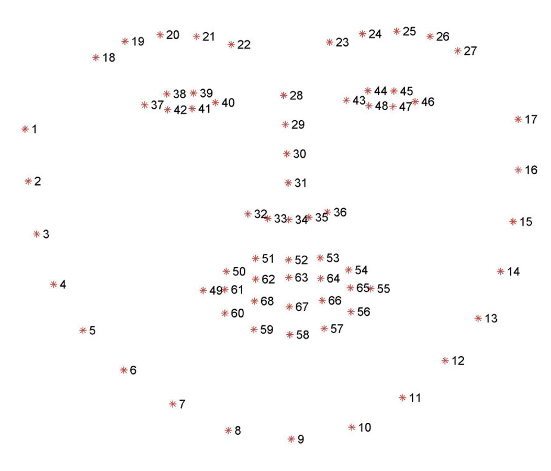
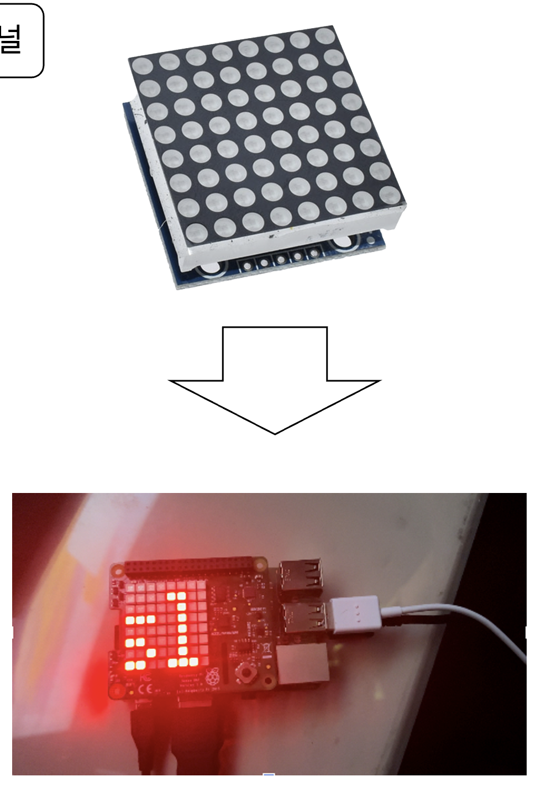
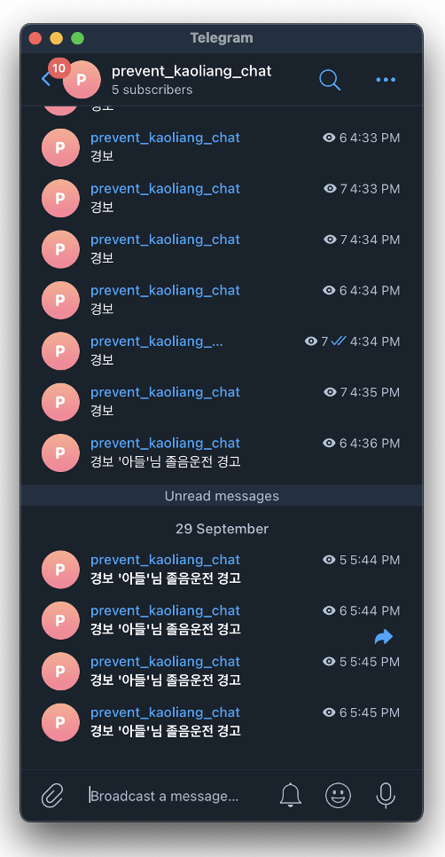
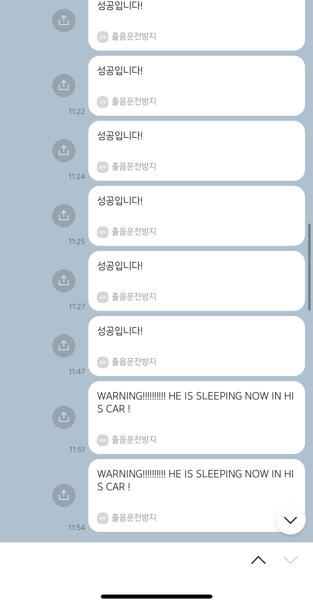
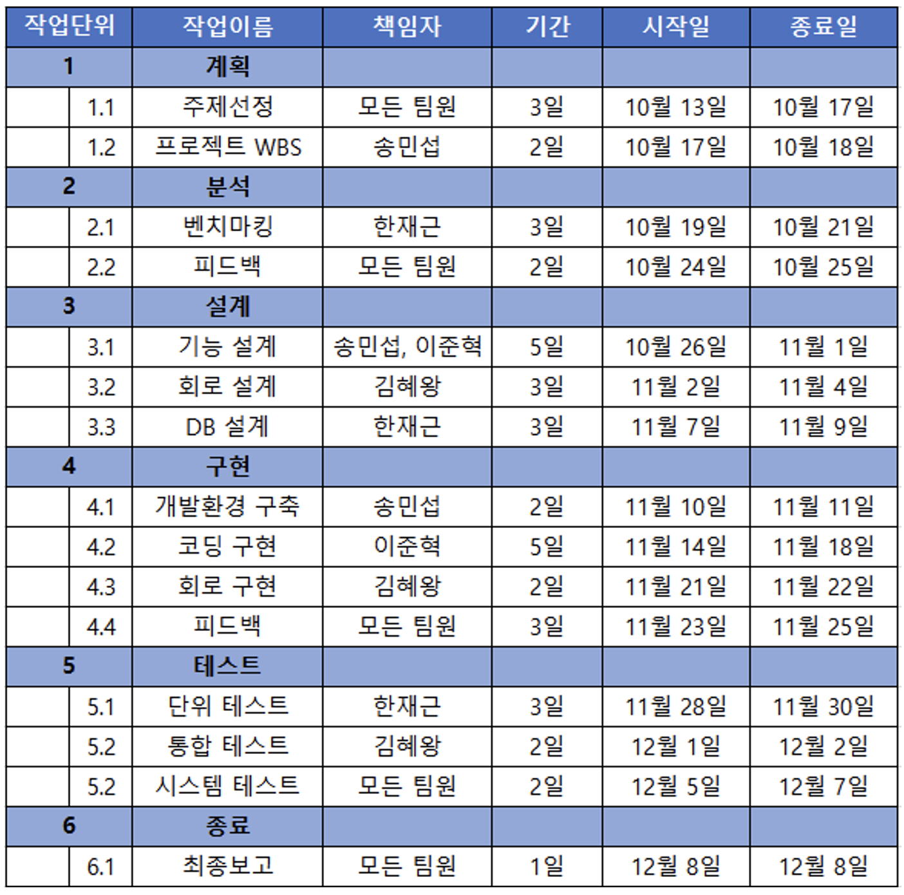

> # 2022 온라인 메이커 경진대회 최우수상& 3학년 2학기 무선 네트워크 프로젝트
> # 졸음운전 감지 센서

 

캠을 통해 사용자의 눈을 인식하고, 일정 시간 이상 눈을 감고 있으면 경고와 함께 주변 지인(가족)에게 경고 메세지(텔레그램, 카카오톡)를 전송하는 프로그램

 
 
 

> ## 목차

## [1. 주제 선정 동기](#주제-선정-동기)
## [2. 기존 졸음운전 감지 시스템과의 차이점](#기존-졸음운전감지-시스템과의-차이점)
## [3. 팀원](#팀원)
## [4. 하드웨어](#개발-환경하드웨어)
## [5. 소프트웨어](#소프트웨어)
## [6. Python Library](#python-library)
## [7. 기능](#기능)
 * ## [7-1. 얼굴 인식](#얼굴-인식)
 * ## [7-2. LED](#led)
 * ## [7-3.경고음](#경고음)
 * ## [7-4. 텔레그램 전송](#텔레그램-전송)
 * ## [7-5. 카카오톡 메세지 전송](#카카오톡-메세지-전송)
## [8. 프로젝트를 진행하면서...](#프로젝트를-진행하면서)

 
 
 

# 주제 선정 동기

교통사고 통계에 의하면 졸음 운전 사건 사고 건수가 가장 큰 비중을 차지하여 라즈베리파이를 이용하여 실질적 해결책을 제시하고자 한다.

 
 
 

# 기존 졸음운전감지 시스템과의 차이점 

* 메신저(텔레그램, 카카오톡)와 연동해서 졸음 운전 감지  
* LED 패널의 존재로 본인뿐 아니라 주변 운전자들이 파악

 
 
 

# 팀원

202044026 김혜왕  
201744010 송민섭  
202044021 이준혁  
202044029 한재근

 
 
 

# 개발 환경

* python 3.9.2
* openCV

* 라즈베리파이 4  
* SSD 256GB
* 웹 캠
* LED, 부저
* LED 판

 
 
 

# Python Library

* cv2
* dlib
* numpy
* functools
* scipy.spatial
* time
* telegram
* requests
* json

 
 
 

# 기능

> ## 얼굴 인식

얼굴을 인식하고 눈을 인식하여 눈을 감았을 때를 측정한다.  
눈이 감겼다고 인식한 상태에서 1분동안 3초 이상 연속적으로 눈을 감았을 시 경보음과 LED를 작동시켜 운전자에게 경고를 주며, LED 패널을 이용하여 주변 운전자에게 알린다.  
또한 카카오톡 및 텔레그램으로 지인(가족)에게 메세지를 전송한다.

 
 

> ## LED

얼굴 인식을 통해 졸음 운전이라고 파악될 경우 

 
 

> ## 경고음

얼굴 인식을 통해 졸음 운전이라고 파악될 경우 경고음을 울려 운전자에게 알린다.

 
 

> ## 텔레그램 전송

얼굴 인식을 통해 졸음 운전이라고 파악될 경우 지인(가족)에게 텔레그렘을 통해 메세지를 전송해 운전자에게 경각심을 부여하고 사고를 예방할 수 있게 한다.

 
 

> ## 카카오톡 메세지 전송

얼굴 인식을 통해 졸음 운전이라고 파악될 경우 지인(가족)에게 카카오톡을 통해 메세지를 전송해 운전자에게 경각심을 부여하고 사고를 예방할 수 있게 한다.

 
 
 

> ## WBS

 
 
 

# 프로젝트를 진행하면서...

> ## 이준혁

## 졸음 운전을 판단하는 기준 :  

프로젝트의 주제가 사람의 생명과도 연관외 될 수 있다는 점에 졸음운전의 판단 기준이 무엇보다 가장 중요하다고 생각했다.  
하지만 프로젝트를 진행하면서 졸음 운전을 판단할 때 눈을 감았을 때의 기준을 정하는 것과, 눈을 어떻게 어느정도 감았을 때 졸음운전인지 판단하는 것이 가장 어려웠다.   

프로젝트 초반, 눈의 윗 부분과 아랫 부분의 길이를 측정하여 그 길이가 0cm 혹은 1cm 정도가 되었을 때를 눈을 감았다고 하기로 하였다. 

하지만 사람마다 눈의 크기 및 생김새가 달라 openCV를 통해 측정하는 눈의 위 아래 길이가 사람마다 달랐으며, 카메라의 위치 혹은 사람과 카메라의 거리까지 영향을 미치는 것을 확인하였고, 매번 결과가 달라지는 것을 반복하였다.  

해결 방법은 정말 간단했다.  팀원들 뿐만 아니라 여러 사람들에게 테스트를 계속해서 해보면서 인식이 가장 잘 되는 수치를 찾아내고 이를 적용시키는 것이었다.  
이를 통해 프로젝트를 마치면서 진행하는 알파, 베타 테스터 뿐만 아니라 개발 중에 수행하는 테스트가 정말 중요하다는 것 또한  느꼈으며, 테스트는 프로젝트의 처음부터 마무리 단계까지 또는 유지보수 단계에서도 중요하다는 것을 느꼈다.

 
 

## 졸음운전을 하는 운전자에게 어떻게 하면 졸음을 없앨 수 있을까?  

프로젝트를 시작할 때 시각적, 청각적으로 운전자에게 자극을 주어 졸음을 없애는 것이 가장 효율적이라고 생각했다.  
하지만 시각적으로 운전자에게 자극을 주게 될 경우 운전할 때 오히려 더욱 위험이 될 것 같다는 판단 하에 이는 기능에서 빼도록 하였다.  

그렇다면 청각적으로만 자극을 주게 된다면 졸음을 깰 수 있을까 라는 의문을 팀원 모두 가지게 되었는데, 그 때 주변인에게 졸음 운전을 하고 있다는 것을 알리게 되면 경각심을 가지게 되어 졸음을 완전히 깨진 못하더라도 졸음 쉼터에서 쉬도록 하는 등의 판단을 내릴 수 있게 하는 것이 어떻냐는 의견이 나왔다.  

졸음 운전 껌과 같이 자극을 주려는 제품은 많기도 했고, 무엇보다 졸음운전은 운전자가 올바른 판단을 할 수 있는 정신력이 가장 중요하다고 여겼기에 주변 지인에게 메세지를 전송하는 기능을 적극적으로 구현하였다.  

이를 통해 기능 혹은 의견을 내야할 상황에서는 가능성, 실현성을 우선시 하지 말고 최대한 많은 의견을 모은 뒤 점차 줄여 나가는 방법이 더욱 효율적이고 더 좋은 의견을 낼 수 있다는 것을 알게 되었으며 이는 실제 사용하게 될 사용자에게까지 연결될 수 있다는 것을 느꼈다.

 
 
 

> ## 송민섭

혼자 했다면 막막했을 아이디어들도 팀원들과 협력하여 수월하게 마칠 수 있었고 결과에 대한 즉각적인 피드백들이 오고가며 효율적인 시간 내에 프로젝트가 진행됐다. 
파이썬 라이브러리와 오픈소스 활용 실력이 늘었으며 혼자 프로젝트를 진행하는것과 비교해서 더 많은 책임감을 가졌고 흥미 또한 더욱 가졌다.

아쉬운점으로는 임의의 센서로 대체하여 테스트 하는것이 아닌 실제 차량 내부에 설치하고  연동하여 테스트 해보고 싶었지만 기술적인 문제로 진행하지 못한 부분이 아쉽다.

 
 
 

> ## 김혜왕

졸음운전 방지 시스템 팀의 김혜왕 입니다. 처음 프로젝트를 시작했을 때에는 단순히 입상이 아닌 대회 참가에 의의를 두자는 마음으로 시작했습니다. 그러다 주제를 생각해내고 프로젝트를 진행하면서 점점 완성도가 높아지는 것을 보며 프로젝트에 애정을 가지고 진행하게 되었습니다. 조금 더 좋은 방법을 생각해보고 교수님들에게 질문을 하며 더 많은 기능을 추가하려고 노력했습니다. 접해보지 못했던 기능들은 많은 어려움이 있었지만 방법을 계속해서 찾아보고 안될 것 같다고 포기하지 않고 계속 시도해 본 것이 입상까지 이어질 수 있었던 것 같습니다.

 
 
 

> ## 한재근

라즈베리를 통해 접해보지 못한 센서들을 이용해서 프로젝트를 잘 마무리하게 되었다.
대학교 생활을 하면서 경진대회에 나갈 수 있는 경험은 없을것이라고 생각했는데 
교수님과 팀원들 덕분에 경기도 경진대회에서 최우수상을 입상하고 경험적으로 도움이 많이 되었다.
또한, 전공에 대해 깊이 공부할 수 있는 자신감과 용기가 생겻다.
UDP라는 수업을 들으면서 라즈베리파이에 관심이 많이 가게 되었고 수강신청을 잘 했다는 생각이 들었다.
아쉬운점이 있다면 라즈베리파이에 대한 지식이나 관심이 더 있었더라면 기능적인 부분을 더 추가 하고 팀원들에게 더
도움이 될 수 있지 않았을까라는 생각이 들었다.

